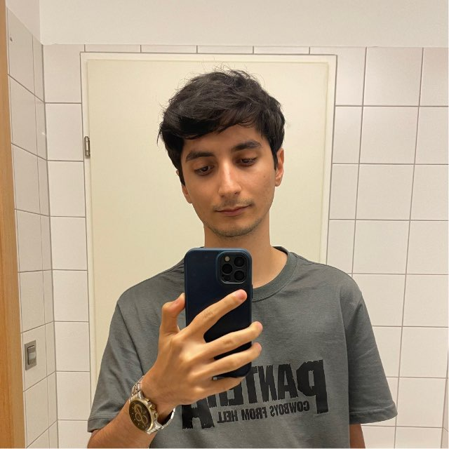

# Welcome

Welcome to Spring 2026 offering of Deep Reinforcement Learning course at Sharif University of Technology! We are excited to have you join us on this journey into the world of deep reinforcement learning.

> **Previous Course (Spring 2025):** [DeepRLCourse Spring 2025](https://deeprlcourse.github.io/)

## Course Description

This course provides an in-depth introduction to the field of deep reinforcement learning. Initially, we will explore reinforcement learning conceptually and practically to help you grasp the fundamental concepts. This phase will take place before Nowrouz. After Nowrouz, we will delve deeper into the subject, focusing on advanced topics. The course will cover both classical reinforcement learning and deep reinforcement learning, including interesting topics such as multi-agent RL, offline methods, and meta RL. By the end of the course, you will have a solid understanding of how to apply deep reinforcement learning to solve complex problems in various domains.

## Learning Objectives

- Understand the fundamentals of reinforcement learning
- Apply reinforcement learning to various domains
- Use deep learning techniques to handle large state spaces in RL
- Master the concepts and gain practical understanding of RL
- Gain hands-on experience with important RL problems
- Equip students with enough theoretical knowledge to understand research papers

## Instructor

-   {align=left width="150"}
    
        
**Dr. Mohammad Hossein Rohban**

        
Instructor

        
[rohban@sharif.edu](mailto:rohban@sharif.edu)

        

        [:fontawesome-brands-x-twitter:](https://x.com/MhRohban){:target="_blank"}
        [:fontawesome-brands-google-scholar:](https://scholar.google.com/citations?user=pRyJ6FkAAAAJ){:target="_blank"}
        [:fontawesome-brands-github:](https://github.com/rohban-lab){:target="_blank"}
        [:fontawesome-brands-linkedin-in:](https://linkedin.com/in/mohammad-hossein-rohban-75567677){:target="_blank"}
        

    

## Schedule

| 
Session #
 | 
Topic of the Session
 | 
Date
 | 
Related Homework
 | 
Related Project
 | 
Related Exam
 |
| :-: | :-: | :-: | :-: | :-: | :-: |
| Session 1 | Introduction to RL | 
3 اسفند (Feb 22)
 | HW 1 | Project 1 | Midterm 1 |
| Session 2 | Introduction to RL | 
5 اسفند (Feb 24)
 | HW 1 | Project 1 | Midterm 1 |
| Session 3 | Value Based | 
10 اسفند (March 1)
 | HW 1 | Project 1 | Midterm 1 |
| Session 4 | Value Based | 
12 اسفند (March 3)
 | HW 1 | Project 1 | Midterm 1 |
| Session 5 | Policy Based | 
17 اسفند (March 8)
 | HW 2 | Project 1 | Midterm 1 |
| Session 6 | Policy Based | 
19 اسفند (March 10)
 | HW 2 | Project 1 | Midterm 1 |
| Session 7 | Actor Critic | 
24 اسفند (March 15)
 | HW 3 | Project 1 | Midterm 1 |
| Session 8 | Actor Critic | 
26 اسفند (March 17)
 | HW 3 | Project 1 | Midterm 1 |
| Session 9 | Dedicated to Previous Topics | HW 3 | 
16 فروردین (April 5)
 | Project 1 | Midterm 1 |
| Session 10 | Model Based | 
18 فروردین (April 7)
 | HW 4 | Project 2 | Midterm 2 |
| Session 11 | Model Based | 
23 فروردین (April 12)
 | HW 4 | Project 2 | Midterm 2 |
| Session 12 | Model Based | 
30 فروردین (April 19)
 | HW 4 | Project 2 | Midterm 2 |
| Session 13 | Model Based | 
1 اردیبهشت (April 21)
 | HW 4 | Project 2 | Midterm 2 |
| Session 14 | Multi-armed Bandits | 
6 اردیبهشت (April 26)
 | HW 5 | Project 2 | Midterm 2 |
| Session 15 | Multi-armed Bandits | 
8 اردیبهشت (April 28)
 | HW 5 | Project 2 | Midterm 2 |
| Session 16 | RL Theory | 
13 اردیبهشت (May 3)
 | HW 6 | Project 2 | Midterm 2 |
| Session 17 | RL Theory | 
15 اردیبهشت (May 5)
 | HW 6 | Project 2 | Midterm 2 |
| Session 18 | Exploration Methods | 
20 اردیبهشت (May 10)
 | HW 7 | - | Final |
| Session 19 | Exploration Methods | 
22 اردیبهشت (May 12)
 | HW 7 | - | Final |
| Session 20 | Imitation and Inverse RL | 
27 اردیبهشت (May 17)
 | HW 8 | - | Final |
| Session 21 | Imitation and Inverse RL | 
29 اردیبهشت (May 19)
 | HW 8 | - | Final |
| Session 22 | Imitation and Inverse RL | 
3 خرداد (May 24)
 | HW 8 | - | Final |
| Session 23 | Offline Methods | 
5 خرداد (May 26)
 | HW 9 | - | Final |
| Session 24 | Offline Methods | 
10 خرداد (May 31)
 | HW 9 | - | Final |
| Session 25 | Offline Methods | 
12 خرداد (June 2)
 | HW 9 | - | Final |
| Session 26 | Meta RL | 
17 خرداد (June 7)
 | HW 10 | - | Final |
| Session 27 | Meta RL | 
19 خرداد (June 9)
 | HW 10 | - | Final |
| Session 28 | Meta RL | 
24 خرداد (June 14)
 | HW 10 | - | Final |

## Logistics & Policies 

- **Lectures:** Held on Sundays and Tuesdays from 1:30 PM to 3:00 PM in room 102 of the CE department.

- **TA Sessions:** Coming soon!

## Grading

The grading for the Deep Reinforcement Learning course is structured as follows:

### Main Components

- **Homeworks:** Gradual assessment through regular assignments
- **Midterm:** 2 Conceptual understanding tested mid-course
- **Final:** Theoretical knowledge evaluated at the end of the course
- **Project:** 2 Practical Project

| Component      | Points | Date       | Details |
| -------------- | ------ | ------------------ | ---|
| Homeworks            | 7      | - | 10 HWs $\times \approx$ 0.7 each
| Midterm_1        | 3      | 
؟ (?)
 | @ ??:00 AM |
| Midterm_2        | 3      | 
؟ (?)
 | @ ??:00 AM |
| Final          | 6      | 
14 تیر (July 5)
   | @ 14:30 PM |
| Project_1        | 1.5      | 
؟ (?)
 | - |
| Project_2        | 2.5      | 
؟ (?)
 | - |

## Head Assistants

-   {align=left width="150"}
    
        
**Ali Najar**

        
Head TA

        
[anajar13750@gmail.com](mailto:anajar13750@gmail.com)

        

        [:fontawesome-brands-github:](https://github.com/Ali-Najar){:target="_blank"}
        

    
-   {align=left width="150"}
    
        
**Mohammad Pouya Toroghi**

        
Head TA

    

## Teaching Assistants

-   {align=left width="150"}
    
        
**Milad Hosseini**

        
Teaching Assistant

    

-   {align=left width="150"}
    
        
**Alireza Nobakht**

        
Teaching Assistant

    

-   {align=left width="150"}
    
        
**Parsa Ghezelbash**

        
Teaching Assistant

    

-   {align=left width="150"}
    
        
**Mazdak Teymourian**

        
Teaching Assistant

    

-   {align=left width="150"}
    
        
**Ramtin Moslemi**

        
Teaching Assistant

    

-   {align=left width="150"}
    
        
**Danial Parnian**

        
Teaching Assistant

    

-   {align=left width="150"}
    
        
**Amirmahdi Meighani**

        
Teaching Assistant

    

-   {align=left width="150"}
    
        
**Mobin Bagherian**

        
Teaching Assistant

    

-   {align=left width="150"}
    
        
**Amir Kooshan Fattah**

        
Teaching Assistant

    

-   {align=left width="150"}
    
        
**SeyedAhmad MousaviAwal**

        
Teaching Assistant

    

## Acknowledgements

We would like to express our gratitude to the following individuals for their invaluable contributions to the Spring 2025 and 2024 offerings of this course. Their efforts have been instrumental in the development and success of this course.

    
<b>Spring 2025</b>

    Arash Alikhani
    Soroush VafaeiTabar
    Amir Mohammad Izadi
    Abdollah Zohrabi
    Ahmad Karami
    SeyyedAli MirGhasemi
    Alireza Nobakht
    Amirabbas Afzali
    Amirhossein Asadi
    Amirreza Velaei
    Armin Saghafian
    Arshia Gharooni
    Behnia Soleymani
    Benyamin Naderi
    Dariush Jamshidian
    Faezeh Sadeghi
    Ghazal Hosseini
    Hamidreza Ebrahimpour
    Hesam Hosseini
    Mahyar Afshimehr
    Masoud Tahmasbi
    Milad Hosseini
    Mohammad Mohammadi
    MohammadHasan Abbasi
    Naseer Kazemi
    Nima Shirzadi
    Ramtin Moslemi
    Reza GhaderiZadeh

    
<b>Spring 2024</b>

    Alireza Ghahremani
    Alireza Sakhaei Rad
    Amirhossein Mohammadpour Azari
    Amirmohammad Izadi
    Arian Ahadinia
    Armin Behnamnia
    Armin Saghefian
    Behnia Soleimani
    Hossein Jafariniya
    Mahdi Ghaznavi
    Mohammadhassan Alikhani
    Ramtin Moslemi

This offering and all of these changes are thanks to their effort in starting this course.