> **New:** [Video Lecture 19](https://deeprl2026.github.io/lectures/lecture19/){:target="_blank"} **!**

# Welcome

Welcome to Spring 2026 offering of Deep Reinforcement Learning course at Sharif University of Technology! We are excited to have you join us on this journey into the world of deep reinforcement learning.

> **Previous Course (Spring 2025):** [DeepRLCourse Spring 2025](https://deeprlcourse.github.io/)

## Learning Objectives

- Understand the fundamentals of reinforcement learning
- Apply reinforcement learning to various domains
- Use deep learning techniques to handle large state spaces in RL
- Master the concepts and gain practical understanding of RL
- Gain hands-on experience with important RL problems
- Equip students with enough theoretical knowledge to understand research papers

## Instructor

-   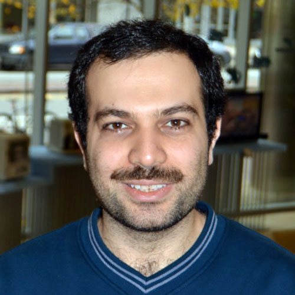{align=left width="150"}
    
        
**Dr. Mohammad Hossein Rohban**

        
Instructor

        
[rohban@sharif.edu](mailto:rohban@sharif.edu)

        

        [:fontawesome-brands-x-twitter:](https://x.com/MhRohban){:target="_blank"}
        [:fontawesome-brands-google-scholar:](https://scholar.google.com/citations?user=pRyJ6FkAAAAJ){:target="_blank"}
        [:fontawesome-brands-github:](https://github.com/rohban-lab){:target="_blank"}
        [:fontawesome-brands-linkedin-in:](https://linkedin.com/in/mohammad-hossein-rohban-75567677){:target="_blank"}
        

    

## Schedule

| 
Session #
 | 
Topic of the Session
 | 
Date
 | 
Deliverables
 |
| :-: | :-: | :-: | :-: |
| Session 1 | Introduction to RL | 
3 اسفند (Feb 22)
 | - |
| Session 2 | Introduction to RL | 
5 اسفند (Feb 24)
 | - |
| Session 3 | Value Based | 
 -   - 
 | - |
| Session 4 | Value Based | 
 -   - 
 | - |
| Session 5 | Value Based | 
 -   - 
 | - |
| Session 6 | Value Based | 
 -   - 
 | - |
| Session 7 | Policy Based | 
 -   - 
 | - |
| Session 8 | Policy Based | 
6 اردیبهشت (March 26)
 | - |
| Session 9 | Policy Based | 
8 اردیبهشت (April 28)
 | Policy Based TA Session/HW2 Release |
| Session 10 | Actor Critic | 
13 اردیبهشت (May 3)
 | - |
| Session 11 | Actor Critic | 
15 اردیبهشت (May 5)
 | Actor Critic TA Session |
| Session 12 | Model Based | 
20 اردیبهشت (May 10)
 | - |
| Session 13 | Model Based | 
22 اردیبهشت (May 12)
 | - |
| Session 14 | Model Based | 
27 اردیبهشت (May 17)
 | - |
| Session 15 | Model Based | 
29 اردیبهشت (May 19)
 | - |
| Session 16 | Multi-armed Bandits | 
3 خرداد (May 24)
 | - |
| Session 17 | Multi-armed Bandits | 
5 خرداد (May 26)
 | MAB TA Session |
| Session 18 | RL Theory | 
10 خرداد (May 31)
 | - |
| Session 19 | RL Theory | 
12 خرداد (June 3)
 | - |
| Session 20 | Exploration Methods | 
17 خرداد (June 7)
 | - |
| Session 21 | Exploration Methods | 
19 خرداد (June 9)
 | Midterm |
| Session 22 | Imitation and Inverse RL | 
24 خرداد (June 14)
 | - |
| Session 23 | Imitation and Inverse RL | 
26 خرداد (June 16)
 | - |
| Session 24 | Imitation and Inverse RL | 
31 خرداد (June 21)
 | - |
| Session 25 | Offline Methods | 
2 تیر (June 23)
 | - |
| Session 26 | Offline Methods | 
7 تیر (June 28)
 | - |
| Session 27 | Offline Methods | 
9 تیر (June 30)
 | - |
| Session 28 (Make-up 1) | Meta RL | 
14 تیر (July 5)
 | - |
| Session 29 (Make-up 2) | Meta RL | 
16 تیر (July 8)
 | Final Exam |

## Logistics & Policies 

- **Lectures:** Held on Sundays and Tuesdays from 1:30 PM to 3:00 PM in room 102 of the CE department. (Online [here](http://vc.sharif.edu/rohban)!)

- **TA Sessions:** Held on Saturdays from 6:00 PM to 7:30 PM Online [here](https://vc.sharif.edu/rohban-ta)!

### Late Submission Policy

- Each student has **14 total late days** for the course.
- Up to **3 late days** may be used per assignment.

## Grading

The grading for the Deep Reinforcement Learning course is structured as follows:

### Main Components

- **Homeworks:** Eight homework assignments, each worth 1 point, plus an additional assignment worth 0.5 points.
- **Midterm:** An online midterm examination followed by additional oral questioning. The material covered includes all topics from the beginning of the course up to and including Multi‑Armed Bandits (MAB), including the content presented in the TA sessions.
- **Final:** A comprehensive final examination primarily covering the material taught after the MAB section. Earlier topics may appear indirectly as prerequisite knowledge, but the exam will directly focus on concepts introduced after that point.
- **Project:** A mini research project in Deep Reinforcement Learning (DRL). Further details and guidelines regarding the project will be announced soon.

| Component      | Points | Date       | Details |
| -------------- | ------ | ------------------ | ---|
| Homeworks            | 8.5      | - | 8 HWs $\times 1 each + 0.5
| Midterm        | 5      | 
22 خرداد June 12
 | @ ??:00 AM |
| Final          | 7      | 
28 تیر July 19
   | @ 14:30 PM |
| Project        | 2.5      | 
؟ (?)
 | - |
| Total        | 23      | - | - |

## Head Assistants

-   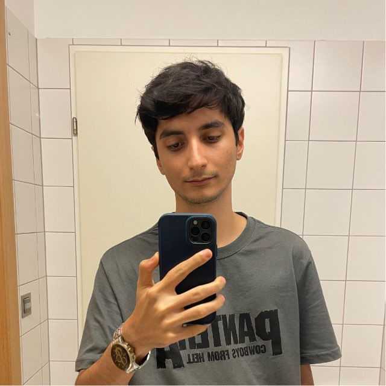{align=left width="150"}
    
        
**Ali Najar**

        
Head TA

        
[anajar13750@gmail.com](mailto:anajar13750@gmail.com)

        

        [:fontawesome-brands-github:](https://github.com/Ali-Najar){:target="_blank"}
        

    
-   {align=left width="150"}
    
        
**Mohammad Pouya Toroghi**

        
Head TA

        
[pouyatoroghi@gmail.com](mailto:pouyatoroghi@gmail.com)

    

## Teaching Assistants

-   {align=left width="150"}
    
        
**Parsa Ghezelbash**

        
Teaching Assistant

    

-   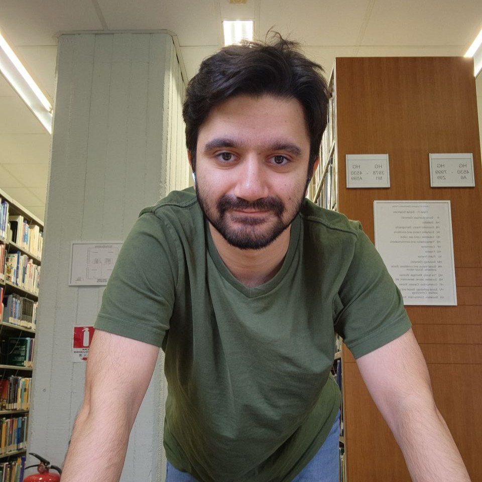{align=left width="150"}
    
        
**Amir Kooshan Fattah**

        
Teaching Assistant

    

-   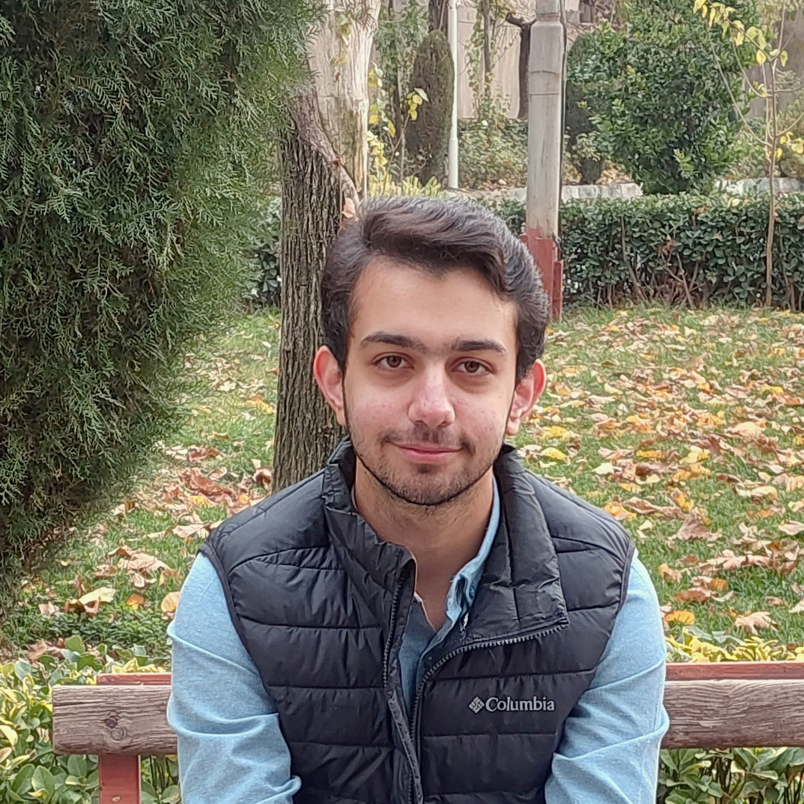{align=left width="150"}
    
        
**Mohammad Amin Abbasfar**

        
Teaching Assistant

    

-   {align=left width="150"}
    
        
**Arian Komaei**

        
Teaching Assistant

    

-   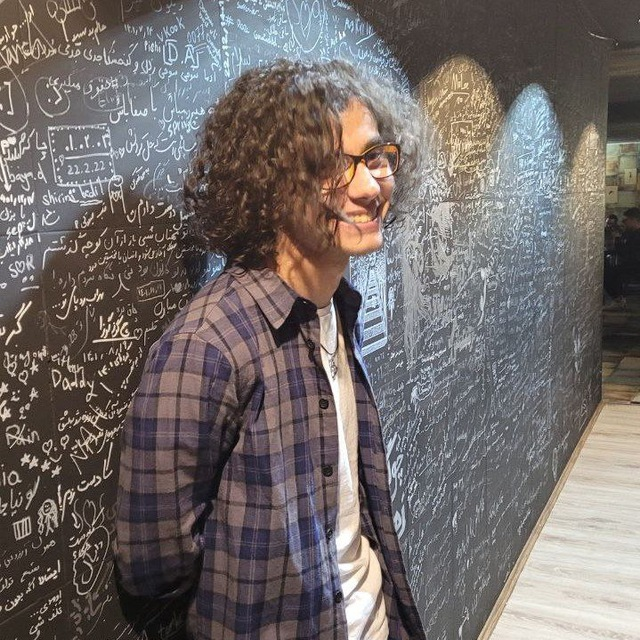{align=left width="150"}
    
        
**Mazdak Teymourian**

        
Teaching Assistant

    

-   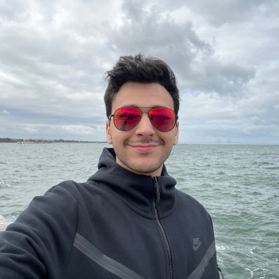{align=left width="150"}
    
        
**Ramtin Moslemi**

        
Teaching Assistant

    

-   {align=left width="150"}
    
        
**Danial Parnian**

        
Teaching Assistant

    

-   {align=left width="150"}
    
        
**Amirmahdi Meighani**

        
Teaching Assistant

    

-   {align=left width="150"}
    
        
**Mobin Bagherian**

        
Teaching Assistant

    

-   {align=left width="150"}
    
        
**Amir Malekhosseini**

        
Teaching Assistant

    

-   {align=left width="150"}
    
        
**Ali Soltani**

        
Teaching Assistant

    

-   {align=left width="150"}
    
        
**Mahshid Dehghani**

        
Teaching Assistant

    

-   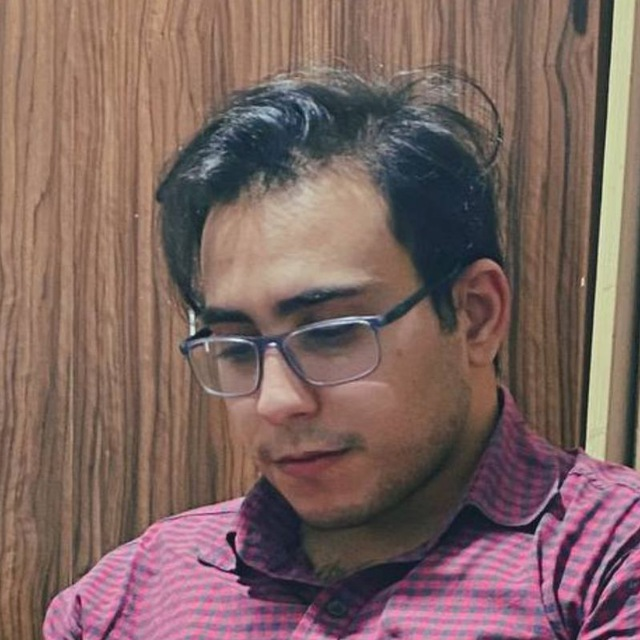{align=left width="150"}
    
        
**Milad Hosseini**

        
Teaching Assistant

    

-   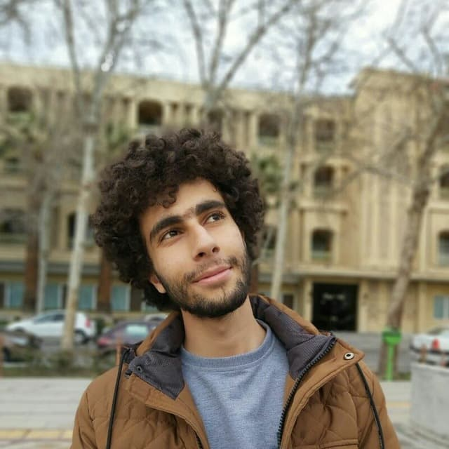{align=left width="150"}
    
        
**Alireza Nobakht**

        
Teaching Assistant

    

-   {align=left width="150"}
    
        
**Amir Homayoun Sharifi-zadeh**

        
Teaching Assistant

    

-   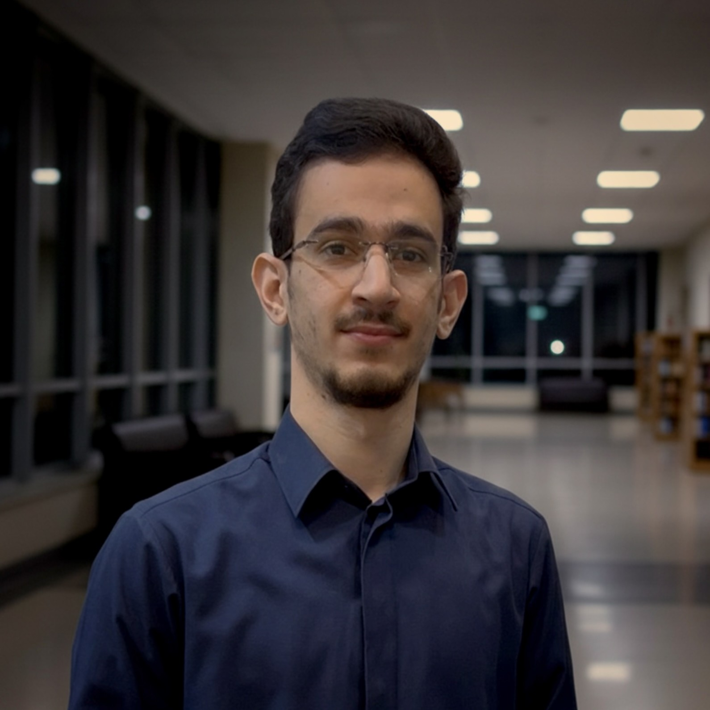{align=left width="150"}
    
        
**Saeed Terik**

        
Teaching Assistant

    

-   {align=left width="150"}
    
        
**Hamidreza Ebrahimpour**

        
Teaching Assistant

    

-   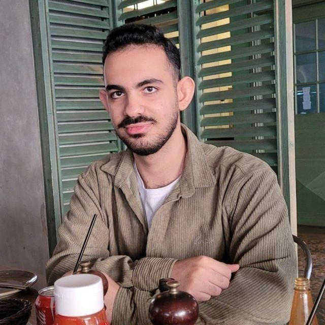{align=left width="150"}
    
        
**Arshia Izadyari**

        
Teaching Assistant

    

-   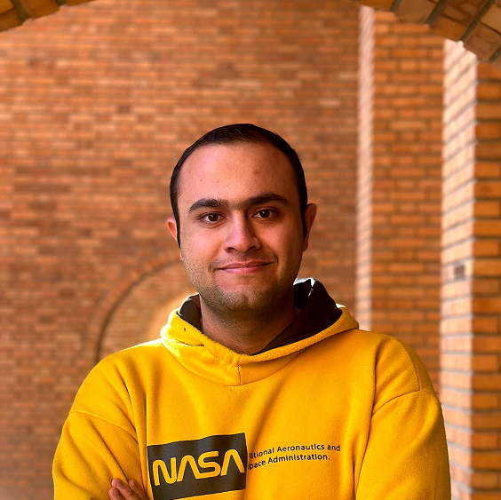{align=left width="150"}
    
        
**SeyedAhmad MousaviAwal**

        
Teaching Assistant

    

## Acknowledgements

We would like to express our gratitude to the following individuals for their invaluable contributions to the Spring 2025 and 2024 offerings of this course. Their efforts have been instrumental in the development and success of this course.

    
<b>Spring 2025</b>

    Arash Alikhani
    Soroush VafaeiTabar
    Amir Mohammad Izadi
    Abdollah Zohrabi
    Ahmad Karami
    SeyyedAli MirGhasemi
    Alireza Nobakht
    Amirabbas Afzali
    Amirhossein Asadi
    Amirreza Velaei
    Armin Saghafian
    Arshia Gharooni
    Behnia Soleymani
    Benyamin Naderi
    Dariush Jamshidian
    Faezeh Sadeghi
    Ghazal Hosseini
    Hamidreza Ebrahimpour
    Hesam Hosseini
    Mahyar Afshimehr
    Masoud Tahmasbi
    Milad Hosseini
    Mohammad Mohammadi
    MohammadHasan Abbasi
    Naseer Kazemi
    Nima Shirzadi
    Ramtin Moslemi
    Reza GhaderiZadeh

    
<b>Spring 2024</b>

    Alireza Ghahremani
    Alireza Sakhaei Rad
    Amirhossein Mohammadpour Azari
    Amirmohammad Izadi
    Arian Ahadinia
    Armin Behnamnia
    Armin Saghefian
    Behnia Soleimani
    Hossein Jafariniya
    Mahdi Ghaznavi
    Mohammadhassan Alikhani
    Ramtin Moslemi

This offering and all of these changes are thanks to their effort in starting this course.