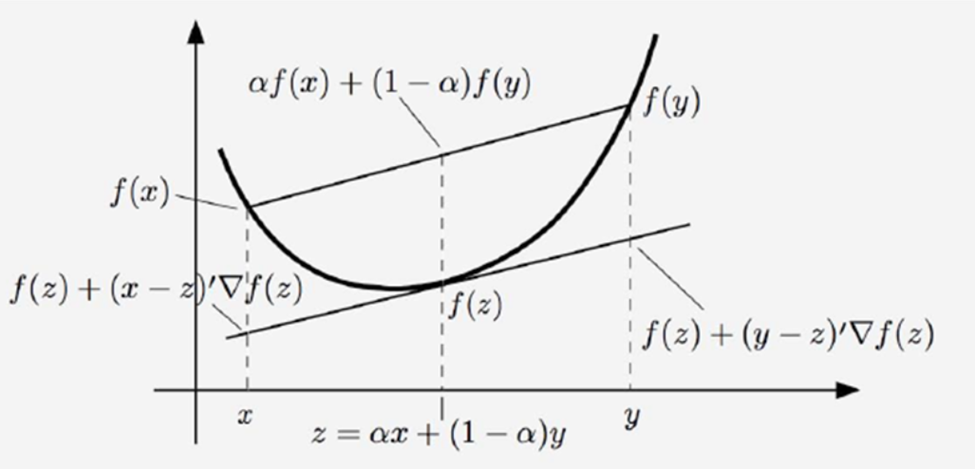
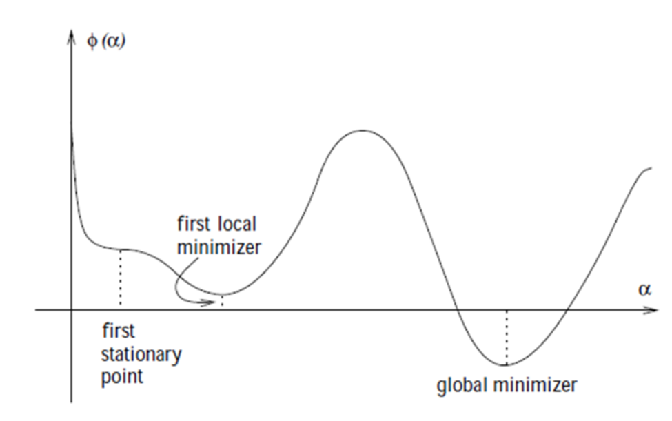
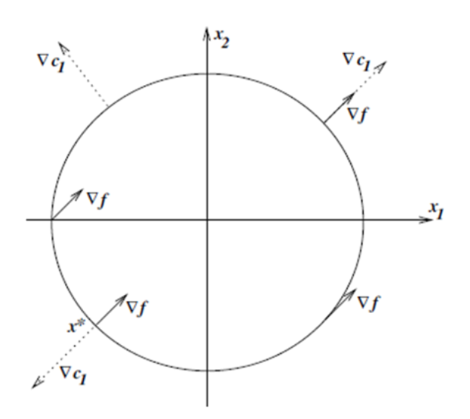

# Numerical Optimization

## Fundamentals

### Taylor’s Theorem

Suppose that \( f : \mathbb{R}^n \to \mathbb{R} \) is continuously differentiable and that \( p \in \mathbb{R}^n \). Then we have that

\[
f(x + p) \approx f(x) + \nabla f(x + tp)^T p
\]

for some \( t \in (0, 1) \). Moreover, if \( f \) is twice continuously differentiable, we have that

\[
f(x + p) \approx f(x) + \int_0^1 \nabla^2 f(x + tp) p \, dt
\]

and that

\[
f(x + p) \approx f(x) + \nabla f(x)^T p + \frac{1}{2} p^T \nabla^2 f(x + tp) p
\]

for some \( t \in (0, 1) \).

Necessary conditions for optimality are derived by assuming that \( x^* \) is a local minimizer and then proving facts about \( \nabla f(x^*) \) and \( \nabla^2 f(x^*) \).

### First-Order Necessary Conditions

If \( x^* \) is a local minimizer and \( f \) is continuously differentiable in an open neighborhood of \( x^* \), then

\[
\nabla f(x^*) = 0.
\]

### Second-Order Sufficient Conditions

Suppose that \( \nabla^2 f \) is continuous in an open neighborhood of \( x^* \), that \( \nabla f(x^*) = 0 \), and \( \nabla^2 f(x^*) \) is positive definite. Then, \( x^* \) is a strict local minimizer of \( f \).

### Theorem
When \( f \) is convex, any local minimizer \( x^* \) is a global minimizer of \( f \). If, in addition, \( f \) is differentiable, then any stationary point \( x^* \) is a global minimizer of \( f \).

### Definition
A **convex function** is a function where, for any two points \( x_1 \) and \( x_2 \) in its domain, and any \( \lambda \in [0, 1] \), the function value at the point \( \lambda x_1 + (1-\lambda) x_2 \) is less than or equal to the weighted average of the function values at \( x_1 \) and \( x_2 \):

\[
f(\lambda x_1 + (1-\lambda) x_2) \leq \lambda f(x_1) + (1-\lambda) f(x_2)
\]

### Theorem
Let \( C \subseteq \mathbb{R}^n \) be a convex set and let \( f: \mathbb{R}^n \to \mathbb{R} \) be differentiable over \( \mathbb{R}^n \).  
(a) The function \( f \) is convex over \( C \) iff \( f(z) \geq f(x) + (z - x) \cdot \nabla f(x) \), for all \( x, z \in C \).  
(b) If the inequality is strict whenever \( x \neq z \), then \( f \) is strictly convex over \( C \).

## Rate of Convergence

Let \( \{ x_k \mid x_k \in \mathbb{R}^n \} \) be a sequence such that \( x^* = \lim_{k \to \infty} x_k \).

The convergence is:
- Q-linear if for a constant \( r \in (0,1) \):

\[\| x_{k+1} - x^* \| \leq r \| x_k - x^* \|\]

- Q-superlinear if:

\[\lim_{k \to \infty} \frac{\| x_{k+1} - x^* \|}{\| x_k - x^* \|} = 0\]

- \( p \) Q-order if for a constant \( M \):

\[\| x_{k+1} - x^* \| \leq M \| x_k - x^* \|^p\]

---

## Line Search
Often, in the methods we use for optimizing nonlinear functions, finding descent directions at the current point and moving in those directions to find a point with a lower value is done iteratively. However, the issue that arises is the step size, which itself becomes an optimization problem called Line Search.

Which its problem is as follows:

\[\min_{\alpha > 0} f(x_k + \alpha p_k)\]

we would derive the maximum benefit from the direction \( p_k \).
### Conditions
The ideal choice would be the global minimizer of the univariate function \( \varphi(\cdot) \) defined by

\[\varphi(\alpha) = f(x_k + \alpha p_k), \quad \alpha > 0,\]

The **sufficient decrease** and **curvature conditions** are known collectively as the **Wolfe conditions**

- \( f(x_k + \alpha p_k) \leq f(x_k) + c_1 \alpha \nabla f_k^T p_k \) (**sufficient decrease**)
- \( \nabla f(x_k + \alpha_k p_k)^T p_k \geq c_2 \nabla f_k^T p_k \) (**curvature condition**)

with \( 0 < c_1 < c_2 < 1 \).

**Figure: Sufficient decrease condition**

------------------------------------------------

**Figure: The curvature condition**

----------------------------------------------

### Theorem:

Consider any iteration of the form \( x_{k+1} = x_k + \alpha_k p_k \), where \( p_k \) is a descent direction and \( \alpha_k \) satisfies the Wolfe conditions. Suppose that \( f \) is bounded below in \( \mathbb{R}^n \) and that \( f \) is continuously differentiable in an open set \( \mathcal{N} \) containing the level set \( \mathcal{L} \equiv \{ x : f(x) \leq f(x_0) \} \), where \( x_0 \) is the starting point of the iteration. Assume also that the gradient \( \nabla f \) is Lipschitz continuous on \( \mathcal{N} \), that is, there exists a constant \( L > 0 \) such that

\[\| \nabla f(x) - \nabla f(\tilde{x}) \| \leq L \| x - \tilde{x} \|, \quad \text{for all } x, \tilde{x} \in \mathcal{N}.\]

Then

\[\sum_{k \geq 0} \cos^2 \theta_k \| \nabla f_k \|^2 < \infty.\]

Since \( |\cos \theta_k| \geq c > 0 \), we can see that the gradients \( \| \nabla f_k \| \) must shrink to zero as the iterations progress. Otherwise, the sum would not be finite, which leads to the conclusion that \( \nabla f_k \) converges to zero.

## Trust Region

The **Trust Region** method uses the information gathered about \( f \) to construct a model function \( m_k \) whose behavior near the current point \( x_k \) is similar to that of the actual objective function \( f \). Because the model \( m_k \) may not be a good approximation of \( f \) when \( x \) is far from \( x_k \), we restrict the search for a minimizer of \( m_k \) to some region around \( x_k \).

\[\min_{p} \, m_k(x_k + p), \, \text{where} \, x_k + p \, \text{lies inside the trust region.}\]

Usually, the trust region is a ball defined by \( \|p\|_2 \leq \delta \), where the scalar \( \delta > 0 \) is called the trust-region radius.
For example, one of the functions that can be suitable for \( m_k \) is a quadratic function, which is obtained using the Taylor expansion of the function \( f \) around the point \( x_k \):

\[m_k(x_k + p) = f_k + p^T \nabla f_k + \frac{1}{2} p^T B_k p\]

Where the matrix \( B_k \) is either the Hessian \( H_k = \nabla^2 f_k \) or some approximation to it.

Now, using the mentioned \( m_k \), and optimizing it (taking the gradient with respect to \( p \)), we reach two descent directions: one is the Newton method and the other is the quasi-Newton method, which is used when directly computing the Hessian matrix is costly.

### Newton direction:

\[\nabla_p \, m_k(x_k+p) = 0 \xrightarrow[\exists \, \text{inverse}]{} p_N = - (\nabla^2 f_k)^{-1} \nabla f_k\]

### Quasi-Newton direction:

\[\nabla_p \, m_k(x_k+p) = 0 \xrightarrow[\exists \, \text{inverse}]{} p_{qN} = - (B_k)^{-1} \nabla f_k\]

#### Recursive method for quasi-Newton

\[B_{k+1} = B_k + \frac{(y_k - B_k s_k)(y_k - B_k s_k)^T}{(y_k - B_k s_k)^T s_k}\]

We can rewrite it in the following form (or **BFGS formula**)

\[B_{k+1} = B_k - \frac{B_k s_k s_k^T}{s_k^T B_k s_k} + \frac{y_k y_k^T}{y_k^T s_k}\]

where

\[s_k = x_{k+1} - x_k, \quad y_k = \nabla f_{k+1} - \nabla f_k\]

---

## Theory of Constrained Optimization

In some optimization problems we have, the domain we search for the optimal value is not the entire Euclidean space, but rather, under certain conditions, we are looking for the optimal function. For this reason, we use the theory of Constrained Optimization.

A general formulation:

\[\min_{x \in \mathbb{R}^n} f(x) \quad \text{subject to} \quad 
\begin{cases}
c_i(x) = 0, & \text{for } i \in \mathcal{E}, \\
c_i(x) \geq 0, & \text{for } i \in \mathcal{I},
\end{cases}\]

where \( f \) and the functions \( c_i \) are all smooth, real-valued functions on a subset of \( \mathbb{R}^n \), and \( \mathcal{I} \) and \( \mathcal{E} \) are two finite sets of indices. As before, we call \( f \) the objective function, while \( c_i \),

\( i \in \mathcal{E} \) are the equality constraints and \( c_i \), \( i \in \mathcal{I} \) are the inequality constraints.

Also we can define the feasible set \( \Omega \) to be the set of points \( x \) that satisfy the constraints; that is,

\[\Omega = \{ x \mid c_i(x) = 0, \; i \in \mathcal{E}; \; c_i(x) \geq 0, \; i \in \mathcal{I} \}.\]

so that we can rewrite:

\[\min_{x \in \Omega} f(x).\]

#### Definitions:

- **Standard form problem (not necessarily convex)**

Minimize
\(
f(x)
\)

subject to

\[
0 \leq g_i(x), \quad i = 1, \dots, m
\]

\[
h_i(x) = 0, \quad i = 1, \dots, p
\]

  Variable \( x \in \mathbb{R}^n \), domain \( D \), optimal value \( p^\star \)

- **Lagrangian:**

\( L : \mathbb{R}^n \times \mathbb{R}^m \times \mathbb{R}^p \rightarrow \mathbb{R}, \quad \text{with } \text{dom } L = D \times \mathbb{R}^m \times \mathbb{R}^p \)

\[
L(x, \lambda, \nu) = f(x) - \sum_{i=1}^{m} \lambda_i g_i(x) + \sum_{i=1}^{p} \nu_i h_i(x)
\]

- **Active/Inactive Constraint**:

  An inequality constraint \( h_i(x) \geq 0 \) is called **active** at \( x^* \in \Omega \) if \( h_i(x^*) = 0 \) and otherwise **inactive**.

- **Active Set**:

  The index set \( A(x^*) \subset \{1, \dots, q\} \) of active constraints is called the **active set**.

  **Remark**: Inactive constraints do not influence \( T_\Omega(x^*) \).

- **LICQ (linear independence constraint qualification)**:

  The **linear independence constraint qualification** (LICQ) holds at \( x^* \in \Omega \) iff all vectors \( \nabla g_i(x^*) \) for \( i \in \{1, \dots, m\} \) and \( \nabla h_i(x^*) \) for \( i \in A(x^*) \) are linearly independent.

  **Remark**: This is a technical condition, and is usually satisfied.

- **Linearized Feasible Cone**:

  \(F(x^*) = \{ p \mid \nabla g_i(x^*)^T p = 0, \; i = 1, \dots, m \; \text{and} \; \nabla h_i(x^*)^T p \geq 0, \; i(x^*\}\)

  is called the **linearized feasible cone** at \( x^* \in \Omega \).

#### Example 1:

\[\min_{x} \, f(x) = x_1 + x_2\]

\[\text{s.t.}\]

\[c_1(x) = x_1^2 + x_2^2 - 2 = 0.\]

##### Solution:
The optimal solution is \( x^* = (-1, -1)^T \). From any other point on the circle, one can move in directions that maintain feasibility (stay on the circle) while decreasing \( f(x) \). For instance, from the point \( x = (2, 0)^T \), any clockwise movement on the circle decreases \( f(x) \).

At the solution \( x^* \), the gradient of the objective function \( \nabla f(x) \) is parallel to the gradient of the constraint \( \nabla c_1(x) \), satisfying the Lagrange multiplier condition:

\[\nabla f(x^*) = \lambda^* \nabla c_1(x^*),\]

where \( \lambda^* = -\frac{1}{2} \).

To ensure feasibility, small steps \( s \) must satisfy the condition:

\[\nabla c_1(x)^T s = 0.\]

To decrease the objective function, the step must satisfy:

\[\nabla f(x)^T s < 0.\]

We can express this in terms of first-order Taylor series approximations. To retain feasibility with respect to the constraint, the first-order approximation gives:

\[c_1(x + s) \approx c_1(x) + \nabla c_1(x)^T s = 0,\]

which simplifies to:

\[\nabla c_1(x)^T s = 0.\]

Similarly, to decrease the objective function \( f(x) \), the first-order approximation is:

\[f(x + s) \approx f(x) + \nabla f(x)^T s,\]

and for \( f(x) \) to decrease, we require:

\[\nabla f(x)^T s < 0.\]

The optimal step \( d \) can be calculated as:

\[d = - \frac{\nabla c_1(x) \nabla f(x)^T}{\|\nabla c_1(x)\|^2} \nabla f(x),\]

which ensures feasibility and decreases the objective function.

By introducing the Lagrangian function

\[\mathcal{L}(x, \lambda_1) = f(x) - \lambda_1 c_1(x),\]

and noting that

\[\nabla_x \mathcal{L}(x, \lambda_1) = \nabla f(x) - \lambda_1 \nabla c_1(x),\]

we can state the condition equivalently as follows: At the solution \( x^* \), there is a scalar \( \lambda_1^* \) such that

\[\nabla_x \mathcal{L}(x^*, \lambda_1^*) = 0.\]

#### Example 2:

\(
\min \: \: \: \: \: x_1^2 + x_2^2
\)

\[
\text{s.t.}
\]

\[
x_2 - 1 - x_1^2 \geq 0,
\]

\[
x_1 - 1 \geq 0.
\]

where \( x \in \mathbb{R}^2 \).

### Theorem (First-Order Necessary Conditions):

Suppose that \( x^* \) is a local solution of the optimization problem:

\(
\min_{x \in \mathbb{R}^n} f(x)
\)

subject to:

\[
c_i(x) = 0, \quad i \in \mathcal{E}, \quad c_i(x) \geq 0, \quad i \in \mathcal{I},
\]

where \( x^* \) is the solution, and \( \lambda^* \) is the corresponding Lagrange multiplier vector. Then, the following conditions hold at \( x^* \):

- (a) \( \nabla_x \mathcal{L}(x^*, \lambda^*) = 0 \)
- (b) \( c_i(x^*) = 0 \quad \text{for all} \quad i \in \mathcal{E} \)
- (c) \( c_i(x^*) \geq 0 \quad \text{for all} \quad i \in \mathcal{I} \)
- (d) \( \lambda_i^* \geq 0 \quad \text{for all} \quad i \in \mathcal{I} \)
- (e) \( \lambda_i^* c_i(x^*) = 0 \quad \text{for all} \quad i \in \mathcal{E} \cup \mathcal{I} \)

These conditions are known as the Karush-Kuhn-Tucker (KKT) conditions. The last condition is a complementarity condition, meaning that for any constraint \( i \), either \( c_i(x^*) = 0 \) (active) or \( \lambda_i^* = 0 \) (inactive).

Finally, the necessary condition can be rewritten as:

\[
0 = \nabla_x \mathcal{L}(x^*, \lambda^*) = \nabla f(x^*) - \sum_{i \in A(x^*)} \lambda_i^* \nabla c_i(x^*).
\]

**Definition 12.5 (Strict Complementarity):**

Given a local solution \( x^* \) of the optimization problem and a vector \( \lambda^* \) satisfying the first-order necessary conditions, we say that the strict complementarity condition holds if exactly one of \( \lambda_i^* \) and \( c_i(x^*) \) is zero for each index \( i \in \mathcal{I} \). In other words, we have that \( \lambda_i^* > 0 \) for each \( i \in \mathcal{I} \cap A(x^*) \).

**Example:**

Consider the feasible region illustrated in **Figure below** and described by the four constraints. By restating the constraints in the standard form of the optimization problem and including an objective function, the problem becomes:

\[
\min_x \left( \left( x_1 - \frac{3}{2} \right)^2 + \left( x_2 - \frac{1}{2} \right)^4 \right)
\]

subject to
\(
\begin{bmatrix}
1 - x_1 - x_2 \\
1 - x_1 + x_2 \\
1 + x_1 - x_2 \\
1 + x_1 + x_2
\end{bmatrix} \geq 0.
\)

It is fairly clear from **Figure below** that the solution is \( x^* = (1, 0)^T \). The first and second constraints are active at this point. Denoting them by \( c_1 \) and \( c_2 \) (and the inactive constraints by \( c_3 \) and \( c_4 \)), we have

\(
\nabla f(x^*) = \begin{bmatrix} -1 \\ -1 \end{bmatrix}, \quad
\nabla c_1(x^*) = \begin{bmatrix} -1 \\ -1 \end{bmatrix}, \quad
\nabla c_2(x^*) = \begin{bmatrix} -1 \\ 1 \end{bmatrix}.
\)

Therefore, the KKT conditions are satisfied when we set

\[
\lambda^* = \begin{bmatrix} \frac{3}{4} \\ \frac{1}{4} \\ 0 \\ 0 \end{bmatrix}.
\]

**Lemma**

Let \( x^* \) be a feasible point. The following two statements are true:

- (i) \( T_\Omega(x^*) \subset F(x^*) \).

- (ii) If the LICQ condition is satisfied at \( x^* \), then \( F(x^*) = T_\Omega(x^*) \).

**Theorem**

If \( x^* \) is a local solution of the optimization problem, then we have

\[
\nabla f(x^*)^T d \geq 0, \quad \text{for all} \quad d \in T_\Omega(x^*).
\]

The most important step in proving the previous theorem is a classical result known as **Farkas' Lemma**.

**Farkas' Lemma**

This lemma defines a cone \( K \) as:

\[
K = \{ By + Cw \mid y \geq 0 \}.
\]

For a vector \( g \in \mathbb{R}^n \), Farkas' Lemma states that one of the following alternatives is true:

1. \( g \in K \) (as shown on the left side of the figure),
2. There exists a vector \( d \in \mathbb{R}^n \) such that:
   \( g^T d < 0 , \quad B^Td \geq 0, \quad C^Td = 0.\)

These two cases are illustrated in **the above figure**, where \( B \) has three columns, \( C \) is null, and \( n = 2 \).

Let the cone \( K \) be defined as in the equation above. Given any vector \( g \in \mathbb{R}^n \), either \( g \in K \) or there exists a vector \( d \in \mathbb{R}^n \) satisfying the condition above, but not both.

### Theorem (Second-Order Necessary Conditions).

Suppose that \( x^* \) is a local solution and that the LICQ condition is satisfied. Let \( \lambda^* \) be the Lagrange multiplier vector for which the KKT conditions are satisfied. Then

\[
w^T \nabla^2_{xx} \mathcal{L}(x^*, \lambda^*) w \geq 0, \quad \text{for all} \ w \in C(x^*, \lambda^*).
\]

### Theorem (Second-Order Sufficient Conditions).

Suppose that for some feasible point \( x^* \in \mathbb{R}^n \) there is a Lagrange multiplier vector \( \lambda^* \) such that the KKT conditions (12.34) are satisfied. Suppose also that

\[
w^T \nabla^2_{xx} \mathcal{L}(x^*, \lambda^*) w > 0, \quad \text{for all } w \in C(x^*, \lambda^*), w \neq 0.
\]

## Duality

Duality in optimization provides a method to derive an alternative problem, the dual, related to the original primal problem. Solving the dual can sometimes be easier and provides bounds on the primal solution.

#### Standard Form Problem

Consider the optimization problem:

\[
\min f(x)
\]

subject to:

\[
c_i(x) \geq 0, \quad i = 1, \dots, m
\]

\[
h_i(x) = 0, \quad i = 1, \dots, p
\]

where \( x \in \mathbb{R}^n \) is the variable to optimize.

#### Lagrangian

The Lagrangian is:

\[
L(x, \lambda, \nu) = f_0(x) - \sum_{i=1}^{m} \lambda_i c_i(x) + \sum_{i=1}^{p} \nu_i h_i(x)
\]

where \( \lambda_i \) and \( \nu_i \) are the Lagrange multipliers associated with the inequality and equality constraints, respectively.

#### Dual Function and Problem

The dual function is:

\[
g(\lambda, \nu) = \inf_{x \in D} L(x, \lambda, \nu)
\]

The dual problem is:

\[
\max_{\lambda \geq 0, \nu} g(\lambda, \nu)
\]

This dual formulation provides a lower bound on the optimal value of the primal problem and can often be easier to solve.

### Theorem

The function \( g(\lambda, \nu) \) defined by the dual function is concave, and its domain \( D \) is convex.

#### Proof:

For any \( \lambda^0 \) and \( \lambda^1 \) in \( \mathbb{R}^m \), and any \( \nu^0 \) and \( \nu^1 \) in \( \mathbb{R}^p \), and any \( \alpha \in [0, 1] \), we have:

\[
L(x, (1 - \alpha) \lambda^0 + \alpha \lambda^1, (1 - \alpha) \nu^0 + \alpha \nu^1) = (1 - \alpha) L(x, \lambda^0, \nu^0) + \alpha L(x, \lambda^1, \nu^1)
\]

By taking the infimum of both sides in this expression, using the definition of \( g(\lambda, \nu) \), and applying the result that the infimum of a sum is greater than or equal to the sum of infima, we obtain:

\[
g((1 - \alpha) \lambda^0 + \alpha \lambda^1, (1 - \alpha) \nu^0 + \alpha \nu^1) \geq (1 - \alpha) g(\lambda^0, \nu^0) + \alpha g(\lambda^1, \nu^1)
\]

This confirms the concavity of \( g(\lambda, \nu) \).

If both \( \lambda^0 \) and \( \lambda^1 \) belong to \( D \), and both \( \nu^0 \) and \( \nu^1 \) belong to \( D \), this inequality implies that:

\[
g((1 - \alpha) \lambda^0 + \alpha \lambda^1, (1 - \alpha) \nu^0 + \alpha \nu^1) \geq -\infty
\]

and therefore, \( (1 - \alpha) \lambda^0 + \alpha \lambda^1 \in D \) and \( (1 - \alpha) \nu^0 + \alpha \nu^1 \in D \), verifying the convexity of the domain \( D \).

### Example:

Consider the problem:

\[
\min_{(x_1, x_2)} \, 0.5(x_1^2 + x_2^2) \quad \text{subject to} \quad x_1 - 1 \geq 0
\]

The Lagrangian for this problem is:

\[
L(x_1, x_2, \lambda_1) = 0.5(x_1^2 + x_2^2) - \lambda_1(x_1 - 1)
\]

Holding \( \lambda_1 \) fixed, we minimize the Lagrangian with respect to \( x_1 \) and \( x_2 \). The partial derivatives with respect to \( x_1 \) and \( x_2 \) give:

\[
x_1 = \lambda_1, \quad x_2 = 0
\]

Substituting these values into the Lagrangian, the dual function becomes:

\[
q(\lambda_1) = 0.5(\lambda_1^2 + 0) - \lambda_1(\lambda_1 - 1) = -0.5\lambda_1^2 + \lambda_1
\]

The dual problem is:

\[
\max_{\lambda_1 \geq 0} \left( -0.5\lambda_1^2 + \lambda_1 \right)
\]

Solving this, we find that \( \lambda_1 = 1 \).

### Theorem (Weak Duality)

For any \( \bar{x} \) feasible for the primal problem and any \( \lambda \geq 0 \), we have:

\[
g(\lambda, \nu) \leq f(\bar{x})
\]

#### Proof

The dual function \( g(\lambda, \nu) \) is defined as:

\[
g(\lambda, \nu) = \inf_x \left[ f(x) - \lambda^T c(x) - \nu^T h(x) \right]
\]

Thus,

\[
g(\lambda, \nu) = \inf_x \left[ f(x) - \lambda^T c(x) - \nu^T h(\bar{x}) \right] \leq f(\bar{x}) - \lambda^T c(\bar{x}) - \nu^T h(\bar{x}) \leq f(\bar{x})
\]

where the final inequality follows from \( \lambda \geq 0 \), \( h(\bar{x}) = 0 \), and \( c(\bar{x}) \geq 0 \).

**Definition: (Dual Norm):**

The **dual norm** of a vector \( \nu \) in the dual space \( V^* \) is defined as:

\[
\| \nu \|_* = \sup_{\| x \| \leq 1} \, \nu^T x
\]

It measures the maximum value of \( \nu^T x \) over all vectors \( x \) with \( \| x \| \leq 1 \).

### Example: Equality Constrained Norm Minimization

Consider the problem:

\[
\min \| x \| \quad \text{subject to} \quad A x = b
\]

The dual function is:

\[
g(\nu) = 
\begin{cases} 
b^T \nu & \text{if} \quad \| A^T \nu \|_* \leq 1 \\
-\infty & \text{otherwise}
\end{cases}
\]

where \( \| \nu \|_* \) is the dual norm of \( \nu \).

If \( \| y \|_* \leq 1 \), then \( \| x \| - y^T x \geq 0 \) for all \( x \), with equality when \( x = 0 \). If \( \| y \|_* > 1 \), the function tends to \( -\infty \) as \( t \) approaches infinity.

The lower bound property is:

\[
p^* \geq b^T \nu \quad \text{if} \quad \| A^T \nu \|_* \leq 1
\]

### Example: Quadratic Program

Consider the following quadratic program:

#### Primal Problem (assume \( P \in S^{n}_{++} \))

\[
\min x^T P x
\]

\[
\text{s.t.}
\]

\[
A x \leq b
\]

The dual function is given by:

\[
g(\lambda) = \inf_x \left( x^T P x + \lambda^T (A x - b) \right) = -\frac{1}{4} \lambda^T A P^{-1} A^T \lambda - b^T \lambda
\]

The dual problem is:

\[
\max \left( -\frac{1}{4} \lambda^T A P^{-1} A^T \lambda - b^T \lambda \right)
\]

\[
\text{s.t.}
\]

\[
\lambda \geq 0
\]

### Theorem

Suppose that \( \bar{x} \) is a solution of the primal problem and that \( f \) and \( -c_i \), for \( i = 1, 2, \dots, m \), are convex functions on \( \mathbb{R}^n \) that are differentiable at \( \bar{x} \). Then any \( \lambda \) for which \( (\bar{x}, \lambda) \) satisfies the KKT conditions is a solution of the primal optimization problem.

# References

1. Nocedal, J., & Wright, S. J. (2006). **Numerical Optimization** (2nd ed.). Springer.

2. Bertsekas, D. P. (2009). **Convex Optimization Theory**. Athena Scientific.

3. Boyd, S., & Vandenberghe, L. (2004). **Convex Optimization**. Cambridge University Press.

4. Diehl, M. (2006). **Lecture Notes on Numerical Optimization** (Preliminary Draft). Retrieved from [link or source if applicable].

 
 

## Author(s)

-   {align=left width="150"}
    
        
**Abdollah Zohrabi**

        
Teaching Assistant

        
[abdollahzz1381@gmail.com](mailto:abdollahzz1381@gmail.com)

        

        [:fontawesome-brands-github:](https://github.com/Abz81){:target="_blank"}
        [:fontawesome-brands-linkedin-in:](https://www.linkedin.com/in/abdollah-zohrabi-i2003){:target="_blank"}
        

    

