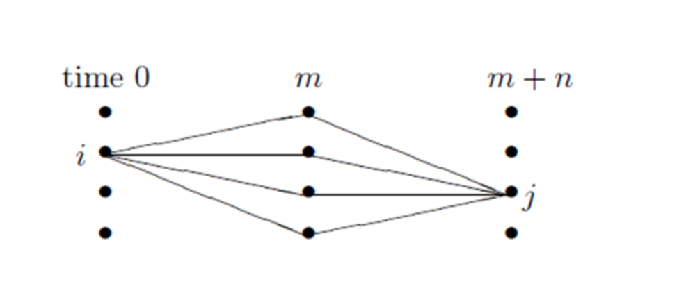

# Stochastic Process

## Preliminary Definitions

**Definition:** A *sample space*, \( \Omega \), is a set of possible outcomes of a random experiment.

---

**Definition:** A *stochastic process* is a family of random variables,

\[
\{ X(t) : t \in T \},
\]

where \( t \) usually denotes *time*. That is, at every time \( t \) in the set \( T \), a random number \( X(t) \) is observed.

---

**Definition:** \( \{ X(t) : t \in T \} \) is a *discrete-time process* *if* the set \( T \) is finite or countable.

*In practice, this generally means \( T = \{0, 1, 2, 3, \ldots\} \).*

Thus a discrete-time process is \( \{ X(0), X(1), X(2), X(3), \ldots \} \): a random number associated with every time \( 0, 1, 2, 3, \ldots \).

---

**Definition:** \( \{ X(t) : t \in T \} \) is a *continuous-time process* *if* \( T \) is *not* finite or countable.

*In practice, this generally means \( T = [0, \infty) \), or \( T = [0, K] \) for some \( K \).*

Thus a continuous-time process \( \{ X(t) : t \in T \} \) has a random number \( X(t) \) associated with every instant in time.

*(Note that \( X(t) \) need not change at every instant in time, but it is allowed to change at *any* time; i.e., not just at \( t = 0, 1, 2, \ldots \), like a discrete-time process.)*

---

**Definition:** The *state space*, \( S \), is the set of real values that \( X(t) \) can take.

Every \( X(t) \) takes a value in \( \mathbb{R} \), but \( S \) will often be a smaller set: \( S \subseteq \mathbb{R} \). For example, if \( X(t) \) is the outcome of a coin tossed at the time \( t \), then the state space is \( S = \{0, 1\} \).

---

**Definition:** The state space \( S \) is *discrete* *if* it is finite or countable. Otherwise it is *continuous*.

---

## Law of Large Numbers

#### The Weak Law of Large Numbers (WLLN)

Let \( X_1, X_2, \ldots \) be a sequence of independent and identically distributed random variables having mean \( \mu \). Then, for any \( \epsilon > 0 \),

\[
P\left( \left| \frac{X_1 + \cdots + X_n}{n} - \mu \right| > \epsilon \right) \to 0 \quad \text{as} \quad n \to \infty
\]

#### The Central Limit Theorem (CLT)

Let \( X_1, X_2, \ldots \) be a sequence of independent and identically distributed random variables having finite mean \( \mu \) and finite variance \( \sigma^2 \). Then

\[
\lim_{n \to \infty} P\left( \frac{X_1 + \cdots + X_n - n\mu}{\sigma \sqrt{n}} < x \right) = \Phi(x)
\]

\[
\Phi(x) = \frac{1}{\sqrt{2\pi}} \int_{-\infty}^{x} e^{-t^2/2} \, dt, \quad -\infty < x < \infty
\]

### Borel-Cantelli
**The Borel-Cantelli Lemma**  
Let \( E_1, E_2, \dots \) denote a sequence of events. If  
\[
\sum_{i=1}^{\infty} P(E_i) < \infty,
\]
then
\[
P(\text{an infinite number of the } E_i \text{ occur}) = 0.
\]

**Converse to the Borel-Cantelli Lemma**  
If \( E_1, E_2, \dots \) are independent events such that
\[
\sum_{n=1}^{\infty} P(E_n) = \infty,
\]
then
\[
P(\text{an infinite number of the } E_n \text{ occur}) = 1.
\]

## Conditional Expectation

#### Definition
For jointly discrete random variables \( X \) and \( Y \), the conditional expectation \( E[X | Y = y] \) is:

\[
E[X | Y = y] = \sum_x x P(X = x | Y = y) = \sum_x x \frac{P(X = x, Y = y)}{P(Y = y)}.
\]

For jointly continuous \( X \) and \( Y \) with joint density \( f(x, y) \):

\[
E[X | Y = y] = \frac{\int_{-\infty}^{\infty} x f(x, y) \, dx}{\int_{-\infty}^{\infty} f(x, y) \, dx}.
\]

Note that \( E[X | Y] \) is a random variable, representing \( E[X | Y = y] \) as a function of \( Y \).

#### Proposition: Law of Iterated Expectation

\[
E[E[X | Y]] = E[X].
\]

For discrete \( Y \):

\[
E[X] = \sum_y E[X | Y = y] P(Y = y).
\]

## Markov Chains
**Markov Chain Definition**

A sequence of random variables \( (X_0, X_1, X_2, \ldots) \) is a *Markov chain* with state space \( \Omega \) and transition matrix \( P \) if, for all \( n \geq 0 \), and all sequences \( (X_0, X_1, \ldots, X_n, X_{n+1}) \), we have:

\[
\mathbb{P}[X_{n+1} = x_{n+1} \mid X_0 = x_0, \ldots, X_n = x_n] = \mathbb{P}[X_{n+1} = x_{n+1} \mid X_n = x_n] = P(x_n, x_{n+1}).
\]

### Example 1: Gambler's Ruin

Consider a gambling game where on any turn you win \$1 with probability \( p = 0.4 \) or lose \$1 with probability \( 1 - p = 0.6 \). You adopt the rule to quit playing if your fortune reaches \$N. If your fortune reaches \$0, the casino stops you.

Let \( X_n \) be your fortune after \( n \) plays. This process has the *Markov property*: given the current state, past states are irrelevant for predicting the next state \( X_{n+1} \). If you are still playing at time \( n \) (i.e., your fortune \( X_n = i \) with \( 0 < i < N \)), then for any history of your wealth \( i_{n-1}, i_{n-2}, \ldots, i_0 \),

\[
P(X_{n+1} = i + 1 \mid X_n = i, X_{n-1} = i_{n-1}, \ldots, X_0 = i_0) = 0.4
\]

### Example 2: Ehrenfest Chain and Transition Matrix

In the Ehrenfest chain, two urns have \( N \) balls. At each step, a ball is picked at random and moved to the other urn. Let \( X_n \) be the number of balls in the "left" urn after \( n \) draws. This has the Markov property:

\[
P(X_{n+1} = i + 1 \mid X_n = i) = \frac{N - i}{N}, \quad P(X_{n+1} = i - 1 \mid X_n = i) = \frac{i}{N},
\]

with \( P(i, j) = 0 \) otherwise. For \( N = 4 \), the transition matrix is:

\[
\begin{array}{c|ccccc}
 & 0 & 1 & 2 & 3 & 4 \\
\hline
0 & 0 & 1 & 0 & 0 & 0 \\
1 & 1/4 & 0 & 3/4 & 0 & 0 \\
2 & 0 & 2/4 & 0 & 2/4 & 0 \\
3 & 0 & 0 & 3/4 & 0 & 1/4 \\
4 & 0 & 0 & 0 & 1 & 0 \\
\end{array}
\]

A transition matrix \( P(i, j) \) defines a Markov chain if:  
(i) \( P(i, j) \geq 0 \) (probabilities).  
(ii) \( \sum_j P(i, j) = 1 \) (next state is certain).

### Example 3: Wright-Fisher Model

Consider a population of \( N/2 \) diploid individuals (or \( N \) haploid individuals) with genes of type \( A \) or \( a \). The population at time \( n+1 \) is obtained by drawing with replacement from the population at time \( n \). Let \( X_n \) be the number of \( A \) alleles at time \( n \). Then \( X_n \) is a Markov chain with transition probability:

\[
p(i, j) = \binom{N}{j} \left( \frac{i}{N} \right)^j \left( 1 - \frac{i}{N} \right)^{N-j},
\]

where the right-hand side is the binomial distribution for \( N \) independent trials with success probability \( i/N \).

### Multistep Transition Probabilities
The transition probability \( p(i, j) = P(X_{n+1} = j \mid X_n = i) \) gives the probability of going from state \( i \) to state \( j \) in one step. Our goal is to compute the probability of going from \( i \) to \( j \) in \( m > 1 \) steps:

\[
p^m(i, j) = P(X_{n+m} = j \mid X_n = i).
\]

This \( p^m(i, j) \) is the \( m \)-th power of the transition matrix \( p \).

### Theorem: (Chapman-Kolmogorov Equation)

The \( m \)-step transition probability satisfies:

\[
p^{m+n}(i, j) = \sum_k p^m(i, k) p^n(k, j).
\]

For \( n = 1 \), this becomes \( p^{m+1}(i, j) = \sum_k p^m(i, k) p(k, j) \), meaning the \( m+1 \)-step probability is the \( m \)-step probability times \( p \).

#### Proof

Consider the probability of transitioning from state \( i \) to state \( j \) in \( m+n \) steps, and split it at time \( m \):

\[
P(X_{m+n} = j \mid X_0 = i) = \sum_k P(X_{m+n} = j, X_m = k \mid X_0 = i).
\]

Apply conditional probability to the joint event:

\[
P(X_{m+n} = j, X_m = k \mid X_0 = i) = P(X_m = k \mid X_0 = i) \cdot P(X_{m+n} = j \mid X_m = k, X_0 = i).
\]

Using the Markov property, the future depends only on the current state at time \( m \):

\[
P(X_{m+n} = j \mid X_m = k, X_0 = i) = P(X_{m+n} = j \mid X_m = k) = p^n(k, j).
\]

Also, \( P(X_m = k \mid X_0 = i) = p^m(i, k) \). Thus:

\[
P(X_{m+n} = j \mid X_0 = i) = \sum_k p^m(i, k) p^n(k, j),
\]

which is \( p^{m+n}(i, j) \), completing the proof.

### Example: Gambler's Ruin

The transition probability for the gambler's ruin with \( N = 4 \) (from Example 1) is:

\[
\begin{array}{c|ccccc}
 & 0 & 1 & 2 & 3 & 4 \\
\hline
0 & 1.0 & 0 & 0 & 0 & 0 \\
1 & 0.6 & 0 & 0.4 & 0 & 0 \\
2 & 0 & 0.6 & 0 & 0.4 & 0 \\
3 & 0 & 0 & 0.6 & 0 & 0.4 \\
4 & 0 & 0 & 0 & 0 & 1.0 \\
\end{array}
\]

Compute \( p^2 \):  
- \( p^2(0, 0) = 1 \), \( p^2(4, 4) = 1 \) (absorbing states).  
- \( p^2(1, 3) = (0.4)^2 = 0.16 \), going up twice.  
- \( p^2(1, 1) = (0.4)(0.6) = 0.24 \), from 1 to 2 to 1.  
- \( p^2(1, 0) = 0.6 \), first jump to 0.

Thus:

\[
p^2 = \begin{pmatrix}
1.0 & 0 & 0 & 0 & 0 \\
0.6 & 0.24 & 0 & 0.16 & 0 \\
0 & 0.36 & 0.48 & 0 & 0.16 \\
0 & 0 & 0.36 & 0.24 & 0.4 \\
0 & 0 & 0 & 0 & 1 \\
\end{pmatrix}
\]

The limiting matrix is:

\[
\lim_{n \to \infty} p^n = \begin{pmatrix}
1.0 & 0 & 0 & 0 & 0 \\
57/65 & 0 & 0 & 0 & 8/65 \\
45/65 & 0 & 0 & 0 & 20/65 \\
27/65 & 0 & 0 & 0 & 38/65 \\
0 & 0 & 0 & 0 & 1 \\
\end{pmatrix}
\]

### Classification of States
**Definition: Probability Under Initial Condition**

For a stochastic process with state \( X_0 \), the notation \( P_x(A) \) represents the probability of event \( A \) given that the process starts in state \( x \):

\[
P_x(A) = P(A \mid X_0 = x).
\]

**Definition: Stopping Time**
A random variable \( T \) is a *stopping time* if the event \( \{ T = n \} \) (the occurrence of "we stop at time \( n \)") can be determined by the values of the process up to time \( n \): \( X_0, \ldots, X_n \). For \( T_y = \min\{ n: X_n = y \} \),

\[
\{ T_y = n \} = \{ X_1 \neq y, \ldots, X_{n-1} \neq y, X_n = y \}.
\]

#### Theorem (Strong Markov Property):
Suppose \( T \) is a stopping time. Given \( T = n \) and \( X_T = y \), the future states \( X_{T+k} \) (for \( k \geq 0 \)) behave like a Markov chain with initial state \( y \), independent of \( X_0, \ldots, X_T \).

---

**Definition (Communication Between States):**

We say that state \( x \) *communicates* with state \( y \), and write \( x \to y \), if there is a positive probability of reaching \( y \) starting from \( x \):

\[
\rho_{xy} = P_x(T_y < \infty) > 0,
\]

where \( T_y \) is the first time the chain reaches state \( y \).

### Lemma on Transitivity of Communication
If \( x \to y \) and \( y \to z \), then \( x \to z \).

**Proof:**

Since \( x \to y \), there exists an \( m \) such that \( p^m(x, y) > 0 \). Similarly, there exists an \( n \) such that \( p^n(y, z) > 0 \). By the Chapman-Kolmogorov equation, \( p^{m+n}(x, z) \geq p^m(x, y) p^n(y, z) > 0 \), so \( x \to z \).

### Theorem on Transience
If \( \rho_{xy} > 0 \) but \( \rho_{yx} < 1 \), then \( x \) is transient.

**Proof**
Let \( K = \min\{ k : p^k(x, y) > 0 \} \), the smallest number of steps to get from \( x \) to \( y \). Since \( p^K(x, y) > 0 \), there exists a sequence \( y_1, \ldots, y_{K-1} \) such that:

\[
p(x, y_1) p(y_1, y_2) \cdots p(y_{K-1}, y) > 0.
\]

Since \( K \) is minimal, all \( y_i \neq y \), and we have:

\[
P_x(T_x = \infty) \geq p(x, y_1) p(y_1, y_2) \cdots p(y_{K-1}, y) (1 - \rho_{yx}) > 0,
\]

so \( x \) is transient.

### Lemma on Recurrence and Communication

If \( x \) is recurrent and \( \rho_{xy} > 0 \), then \( \rho_{yx} = 1 \).

**Proof:**

If \( \rho_{yx} < 1 \), then by the Theorem on Transience, \( x \) would be transient, a contradiction.

#### Remark
The Theorem on Transience allows us to identify all transient states when the state space is finite. 

**Definition of a Closed Set:**
A set \( A \) is closed if it is impossible to get out, i.e., if \( i \in A \) and \( j \notin A \) then \( p(i, j) = 0 \).

In this Example with Specific States \( \{1, 5\} \) and \( \{4, 6, 7\} \) are closed sets. Their union, \( \{1, 4, 5, 6, 7\} \) is also closed. One can add 3 to get another closed set \( \{1, 3, 4, 5, 6, 7\} \). Finally, the whole state space \( \{1, 2, 3, 4, 5, 6, 7\} \) is always a closed set.

**Definition of an Irreducible Set:**
A set \( B \) is called irreducible if whenever \( i, j \in B \), \( i \) communicates with \( j \).

The irreducible closed sets in the Example on Gambler's Ruin with Specific States are \( \{1, 5\} \) and \( \{4, 6, 7\} \). The next result explains our interest in irreducible closed sets.

### Theorem (Recurrence in Finite Irreducible Sets)
If \( C \) is a finite closed and irreducible set, then all states in \( C \) are recurrent.

### Theorem (Decomposition of Finite State Space)
If the state space \( S \) is finite, then \( S \) can be written as a disjoint union \( T \cup R_1 \cup \cdots \cup R_k \), where \( T \) is a set of transient states and the \( R_i \), \( 1 \leq i \leq k \), are closed irreducible sets of recurrent states.

### Recurrence Properties

* If \( x \) is recurrent and \( x \to y \), then \( y \) is recurrent.

* In a finite closed set there has to be at least one recurrent state.

* \( y \) is recurrent if and only if

\[
\sum_{n=1}^{\infty} p^n(y, y) = E_y N(y) = \infty
\] 

where \( E_y N(y) \) is the expected number of visits to \( y \) starting from \( y \).

-----
## Stationary Distributions
Suppose \( \vec{\pi} \) is a limiting probability vector, i.e., for some initial probability vector \( \vec{v} \),

\[
\vec{\pi} = \lim_{n \to \infty} \vec{v} \mathbf{P}^n.
\]

Then

\[
\vec{\pi} = \lim_{n \to \infty} \vec{v} \mathbf{P}^{n+1} = \left( \lim_{n \to \infty} \vec{v} \mathbf{P}^n \right) \mathbf{P} = \vec{\pi} \mathbf{P}.
\]

We call a probability vector \( \vec{\pi} \) an **invariant probability distribution** for \( \mathbf{P} \) if

\[
\vec{\pi} = \vec{\pi} \mathbf{P}.
\]

Such a \( \vec{\pi} \) is also called a **stationary**, **equilibrium**, or **steady-state probability distribution**. Note that an invariant probability vector is a left eigenvector of \( \mathbf{P} \) with eigenvalue 1.

### Lemma
If a stationary distribution exists, then
\[
\lim_{n \to \infty} \mathbf{P}^n = \begin{bmatrix} \vec{\pi} \\ \vec{\pi} \\ \vdots \\ \vec{\pi} \end{bmatrix},
\]

### Example: (General two state transition probability)
Let us start by considering the two-state Markov chain with

\[
\mathbf{P} = \begin{bmatrix} 1-p & p \\ q & 1-q \end{bmatrix},
\]

where \( 0 < p, q < 1 \). This matrix has eigenvalues 1 and \( 1-p-q \). We can diagonalize \( \mathbf{P} \),

\[
\mathbf{D} = \mathbf{Q}^{-1} \mathbf{P} \mathbf{Q},
\]

where

\[
\mathbf{Q} = \begin{bmatrix} 1 & -p \\ 1 & q \end{bmatrix}, \quad \mathbf{Q}^{-1} = \begin{bmatrix} q/(p+q) & p/(p+q) \\ -1/(p+q) & 1/(p+q) \end{bmatrix},
\]

\[
\mathbf{D} = \begin{bmatrix} 1 & 0 \\ 0 & 1-p-q \end{bmatrix}.
\]

The columns of \( \mathbf{Q} \) are right eigenvectors of \( \mathbf{P} \), and the rows of \( \mathbf{Q}^{-1} \) are left eigenvectors. The eigenvectors are unique up to a multiplicative constant.

We choose the left eigenvector for eigenvalue 1 to be a probability vector. \( \vec{\pi} = (q/(p+q), p/(p+q)) \) is the unique invariant probability distribution for \( \mathbf{P} \). Once \( \mathbf{P} \) is diagonalized, we can compute powers:

\[
\mathbf{P}^n = (\mathbf{Q} \mathbf{D} \mathbf{Q}^{-1})^n = \mathbf{Q} \mathbf{D}^n \mathbf{Q}^{-1} = \mathbf{Q} \begin{bmatrix} 1 & 0 \\ 0 & (1-p-q)^n \end{bmatrix} \mathbf{Q}^{-1}.
\]

This simplifies to:

\[
\mathbf{P}^n = \begin{bmatrix} q + p(1-p-q)^n & p - p(1-p-q)^n \\ q - q(1-p-q)^n & p + q(1-p-q)^n \end{bmatrix} / (p+q).
\]

Since \( |1-p-q| < 1 \), we have:

\[
\lim_{n \to \infty} \mathbf{P}^n = \begin{bmatrix} q/(p+q) & p/(p+q) \\ q/(p+q) & p/(p+q) \end{bmatrix} = \begin{bmatrix} \vec{\pi} \\ \vec{\pi} \end{bmatrix}.
\]

The key is that the second eigenvalue \( 1-p-q \) has absolute value less than 1, so the dominant contribution to \( \mathbf{P}^n \) comes from the eigenvalue 1, i.e., the invariant probability distribution.

---

## Irreducible

A transition matrix \( \mathbf{P} \) is called **irreducible**, if for any \( x, y \in \Omega \), there exists a number \( n \) (possibly depending on \( x, y \)) such that

\[
P^n(x, y) > 0.
\]

**Definition**

For any \( x \in \Omega \), define \( T(x) = \{ n \geq 1 : P^n(x, x) > 0 \} \). The **period** of state \( x \) is the greatest common divisor of \( T(x) \), denoted by \( \gcd(T(x)) \).

**Lemma**

If \( \mathbf{P} \) is irreducible, then \( \gcd(T(x)) = \gcd(T(y)) \) for all \( x, y \in \Omega \).

## Aperiodic

**Definition**

For an irreducible chain, the **period of the chain** is defined to be the period which is common to all states. The chain is **aperiodic** if all states have period 1.

**Example**

Consider a simple random walk on an \( N \)-cycle where \( N \) is odd. Then the walk is irreducible and aperiodic.

### Theorem

If \( \mathbf{P} \) is irreducible and aperiodic, then there exists an integer \( r \) such that

\[
P^n(x, y) > 0, \quad \forall x, y \in \Omega, \forall n \geq r.
\]

**Definition**

For \( x \in \Omega \), define

\[
\tau_x = \inf \{ n \geq 0 : X_n = x \}, \quad \tau_x^+ = \inf \{ n \geq 1 : X_n = x \}.
\]

1- \( \tau_x \): the hitting time for \( x \).

2- \( \tau_x^+ \): the first return time when \( X_0 = x \).

### Lemma

Suppose that \( P \) is irreducible. Then, for any \( x, y \in \Omega \), we have

\[
\mathbb{E}_x[\tau_y^+] < \infty
\]

### Perron-Frobenius Theorem (for Finite-State Markov Chains)

Suppose that \( P \) is irreducible, then there exists a probability measure \( \pi \) such that \( \pi = \pi P \) and \( \pi(x) > 0 \) for all \( x \in \Omega \).

### Theorem

Suppose that \( P \) is irreducible. Then there exists a unique stationary distribution. Moreover,

\[
\pi(x) = \frac{1}{\mathbb{E}_x[\tau_x^+]}, \quad \forall x \in \Omega.
\]

### Theorem (Convergence Theorem)

Suppose that \( p \) is irreducible, aperiodic, and has a stationary distribution \( \pi \). Then as \( n \to \infty \): 
\[
p^n(x, y) \to \pi(y).
\]

**Definition:**

Given a graph \( G = (V, E) \), we define *simple random walk on \( G \)* to be the Markov chain with state space \( V \) and transition matrix:

\[
P(x, y) = \begin{cases} 
\frac{1}{\deg(x)} & \text{if } y \sim x \\
0 & \text{else}
\end{cases}.
\]

### Theorem: 
Let

\[
\pi(x) = \frac{\deg(x)}{2|E|}, \quad \forall x \in V.
\]

Then \( \pi \) is a stationary distribution for the simple random walk on the graph.

---
## Countable Markov Chain

**Definition:**  
Let \( \Omega \) be a *countable* state space and \( P \) the *transition matrix*. A stochastic process \( (X_n)_{n \geq 0} \) is a **Markov chain** if for all states \( x, y \in \Omega \),

\[
\mathbb{P}[X_{n+1} = y \mid X_1 = x_1, \dots, X_n = x] = \mathbb{P}[X_{n+1} = y \mid X_n = x] = P(x, y),
\]

i.e., the future state depends only on the present state.

**Chapman-Kolmogorov Equation (Countable Markov Chain):**  
Let \( S \) be a countable state space. The *n-step transition probabilities* are defined by:

\[
p_n(x, y) = \mathbb{P}\{X_n = y \mid X_0 = x\}.
\]

For \( 0 < m, n < \infty \), the Chapman-Kolmogorov equation states:

\[
p_{m+n}(x, y) = \sum_{z \in S} p_m(x, z) \, p_n(z, y).
\]

This expresses that the probability of transitioning from state \( x \) to \( y \) in \( m+n \) steps equals the sum over all intermediate states \( z \in S \), of the probability of transitioning from \( x \) to \( z \) in \( m \) steps and then from \( z \) to \( y \) in \( n \) steps.

**Example 1 (Random Walk with Partially Reflecting Boundary at 0):**  
Let \( 0 < p < 1 \), and let \( S = \{0, 1, 2, \dots\} \). The transition probabilities are:

\[
p(x, y) =
\begin{cases}
1 - p & \text{if } y = x - 1,\ x > 0 \text{ or } x = y = 0, \\
p     & \text{if } y = x + 1, \\
0     & \text{otherwise}.
\end{cases}
\]

This describes a random walk on \( S \) with a partially reflecting boundary at 0.

**Example 2 (Simple Random Walk on the Integer Lattice):**  
Let \( \mathbb{Z}^d \) be the *d*-dimensional integer lattice:

\[
\mathbb{Z}^d = \{ (z_1, \dots, z_d) : z_i \in \mathbb{Z} \}.
\]

Each \( x \in \mathbb{Z}^d \) has \( 2d \) nearest neighbors at distance 1. A simple random walk on \( \mathbb{Z}^d \) is a Markov chain \( (X_n) \) with state space \( S = \mathbb{Z}^d \), where the process moves uniformly to one of the \( 2d \) nearest neighbors. The transition probabilities are:

\[
p(x, y) =
\begin{cases}
\frac{1}{2d} & \text{if } \lVert x - y \rVert = 1, \\
0           & \text{otherwise}.
\end{cases}
\]

### Recurrence and Transience

Let \( X_n \) be an **irreducible Markov chain** with countably infinite state space \( S \) and transition probabilities \( p(x, y) \).

**Definition (Recurrence):**
The chain \( X_n \) is said to be **recurrent** if, for each state \( x \in S \),

\[
\mathbb{P}^x\{X_n = x \text{ for infinitely many } n\} = 1.
\]

That is, the chain returns to the state \( x \) infinitely often with probability 1.

**Definition (Transience):**
If a state \( x \in S \) is not recurrent, it is called **transient**. In this case, the chain visits \( x \) only a finite number of times almost surely.

---

Now, fix a state \( x \) and assume \( X_0 = x \). Define the random variable \( R \) to be the total number of visits to state \( x \), including the initial visit:

\[
R = \sum_{n = 0}^{\infty} I\{X_n = x\},
\]

where \( I\{\cdot\} \) denotes the indicator function. Then the expected number of visits to state \( x \), assuming \( X_0 = x \), is given by:

\[
\mathbb{E}(R) = \sum_{n = 0}^{\infty} \mathbb{P}(X_n = x) = \sum_{n = 0}^{\infty} p_n(x, x).
\]

---

Let \( T = \min\{n > 0 : X_n = x\} \) denote the **time of first return** to state \( x \). Then:

1- If \( \mathbb{P}^x\{T < \infty\} = 1 \), the chain **always returns** to \( x \) and is **recurrent**.

2- If \( \mathbb{P}^x\{T < \infty\} = q < 1 \), the chain **returns with probability less than 1** and is **transient**.

In the transient case, the number of returns \( R \) is a geometric random variable with success probability \( 1 - q \), and its expectation is:

\[
\mathbb{E}(R) = \sum_{m = 1}^{\infty} m \cdot q^{m - 1}(1 - q) = \frac{1}{1 - q} < \infty.
\]

---

**Fact:**
An **irreducible Markov chain** is **transient** if and only if the **expected number of returns** to a state is finite. That is,

\[
\sum_{n = 0}^{\infty} p_n(x, x) < \infty.
\]

### **Example: Recurrence of the Simple Random Walk on \( \mathbb{Z}^d \)**

### Case \( d = 1 \)

We begin with the one-dimensional case. The state space is \( \mathbb{Z} \), and the transition probabilities are given by:

\[
p(x, x + 1) = p(x, x - 1) = \frac{1}{2}.
\]

Assuming the walk starts at the origin (\( X_0 = 0 \)), and noting that the chain has **period 2**, we have:

\[
p_n(0, 0) = 0 \quad \text{for all odd } n.
\]

To compute \( p_{2n}(0, 0) \), observe that the walker must take exactly \( n \) steps to the right and \( n \) steps to the left. The number of such paths is \( \binom{2n}{n} \), each with probability \( (1/2)^{2n} \). Therefore:

\[
p_{2n}(0, 0) = \binom{2n}{n} \left( \frac{1}{2} \right)^{2n} = \frac{(2n)!}{n! \cdot n!} \left( \frac{1}{2} \right)^{2n}.
\]

Applying **Stirling’s approximation**,

\[
n! \sim \sqrt{2\pi n} \cdot n^n e^{-n},
\]

we obtain the asymptotic estimate:

\[
p_{2n}(0, 0) \sim \frac{1}{\sqrt{\pi n}}.
\]

Hence, the total return probability is:

\[
\sum_{n=0}^{\infty} p_{2n}(0, 0) \sim \sum_{n=1}^{\infty} \frac{1}{\sqrt{n}} = \infty.
\]

**Conclusion**: The simple random walk on \( \mathbb{Z} \) is **recurrent**.

---

### Case \( d > 1 \)

Now consider the simple random walk on \( \mathbb{Z}^d \) for \( d > 1 \), with transition probabilities:

\[
p(x, y) = \frac{1}{2d}, \quad \text{if } |x - y| = 1.
\]

Assume the walk starts at the origin. After \( 2n \) steps, by the **law of large numbers**, approximately \( 2n/d \) of the steps are expected in each coordinate direction.

From the one-dimensional result, the probability that a single coordinate returns to zero is approximately:

\[
\left( \pi(n/d) \right)^{-1/2}.
\]

Assuming independence across dimensions, the total return probability becomes:

\[
p_{2n}(0, 0) \sim \left( \frac{1}{2} \right)^{d - 1} \left( \frac{d}{\pi n} \right)^{d/2}.
\]

To determine recurrence, we analyze:

\[
\sum_{n=0}^{\infty} p_{2n}(0, 0) \sim \sum_{n=1}^{\infty} n^{-d/2}.
\]

This series:

\[
\begin{cases}
\text{diverges} & \text{if } d = 1, 2, \\
\text{converges} & \text{if } d \geq 3.
\end{cases}
\]

We conclude:

\[
\sum_{n=0}^{\infty} p_{2n}(0, 0)
\begin{cases}
= \infty, & \text{if } d = 1, 2 \quad \Rightarrow \text{Recurrent}, \\
< \infty, & \text{if } d \geq 3 \quad \Rightarrow \text{Transient}.
\end{cases}
\]

Therefore, the simple random walk on \( \mathbb{Z}^d \) is:

- **Recurrent** for \( d = 1, 2 \)  
- **Transient** for \( d \geq 3 \)

## Continuous Time Markov Chains
There is another type of Markov process, and that is the continuous Markov process.

**Definition: Continuous-Time Markov Chain**

Let \( (X_t)_{t \geq 0} \) be a continuous-time Markov chain. We say that \( (X_t)_{t \geq 0} \) is a continuous-time Markov chain if for all times \( 0 \leq t_1 \leq t_2 \leq \cdots \leq t_{n+1} \) and all \( x_1, x_2, \dots, x_{n+1} \in \Omega \), we have:

\[
\mathbb{P}[X_{t_{n+1}} = x_{n+1} \mid X_{t_1} = x_1, \dots, X_{t_n} = x_n] = \mathbb{P}[X_{t_{n+1}} = x_{n+1} \mid X_{t_n} = x_n].
\]

Moreover, the right-hand side depends only on \( (t_{n+1} - t_n) \).

---

**Definition: Semigroup of the Chain**

Suppose that \( (X_t)_{t \geq 0} \) is a continuous-time Markov chain. Define the transition probabilities as:

\[
P_t(x, y) = \mathbb{P}[X_t = y \mid X_0 = x].
\]

The **semigroup** \( (P_t)_{t \geq 0} \) of the chain is defined as follows:

- \( P_0 = I \) (identity matrix),
- \( P_t \) is a stochastic matrix,
- \( P_{t+s} = P_t P_s \).

---

**Example 1: Poisson Process is Markovian**

The Poisson process is a continuous-time Markov chain with transition probabilities:

\[
P_s(x, y) = e^{-\lambda s} \frac{(\lambda s)^{y - x}}{(y - x)!}.
\]

---

**Example 2: Discrete-Time Markov Chain as Continuous-Time Process**

Let \( (\hat{X}_n)_{n \geq 0} \) be a discrete-time Markov chain with transition matrix \( Q \), and let \( (N_t)_{t \geq 0} \) be an independent Poisson process with intensity \( \lambda > 0 \). Define \( X_t = \hat{X}_{N_t}, t \geq 0 \). Then \( (X_t)_{t \geq 0} \) is a continuous-time Markov chain with transition probabilities:

\[
P_s(x, y) = e^{-\lambda s} \sum_{k=0}^{\infty} \frac{(\lambda s)^k}{k!} Q^k(x, y).
\]

---

### Theorem (Holding Time Exponentially Distributed):

Let \( X_0 = x \), and define the **holding time** at \( x \) as:

\[
S_x = \inf\{ t \geq 0 : X_t \neq x \}.
\]

Then \( S_x \) has an exponential distribution.

---

### Theorem (Memoryless Property of Exponential Distribution)

Let \( T \) be a positive random variable. \( T \) has the memoryless property if:

\[
\mathbb{P}[T > t + s \mid T > s] = \mathbb{P}[T > t],
\]

if and only if \( T \) has an exponential distribution.

# References

1. **Lawler, Gregory F. (2006).**  *Introduction to Stochastic Processes.*  CRC Press.

2. **Durrett, Rick (2010).**  *Essentials of Stochastic Processes.*  2nd Edition, Version Beta.  Cambridge University Press.

3. **MIT OpenCourseWare (2015).**  *Introduction to Stochastic Processes - Spring 2015.*  [Lecture Notes - MIT OCW](https://ocw.mit.edu/courses/18-445-introduction-to-stochastic-processes-spring-2015/pages/lecture-notes/).

4. **Ross, Sheldon M. (2014).**  *Stochastic Processes.*  Second Edition, University of California, Berkeley.  

5. **University of Auckland (2020).**  *COURSE NOTES: STATS 325 - Stochastic Processes.*  Department of Statistics, University of Auckland.  

## Author(s)

-   {align=left width="150"}
    
        
**Abdollah Zohrabi**

        
Teaching Assistant

        
[abdollahzz1381@gmail.com](mailto:abdollahzz1381@gmail.com)

        

        [:fontawesome-brands-github:](https://github.com/Abz81){:target="_blank"}
        [:fontawesome-brands-linkedin-in:](https://www.linkedin.com/in/abdollah-zohrabi-i2003){:target="_blank"}
        

    

